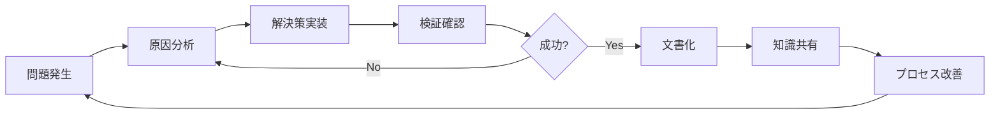

# 🚀 チーム改善計画 - 認識齟齬防止と継続的改善

## 📊 問題分析

### 発生した認識齟齬
1. **BOSSの報告**: Railwayビルドエラー修正完了（コミット: 69d70d1）
2. **実際の状況**: package-lock.json同期エラーが継続（コミット: a30c723後も）
3. **根本原因**: Dockerfile内の`--omit=optional`フラグが残存

### 認識齟齬の原因
- **情報伝達の遅延**: ビルド結果の確認が不十分
- **検証プロセスの欠如**: 修正後の実際のビルド結果を確認せず
- **楽観的報告**: "修正した"ことと"問題が解決した"ことを混同

## 🛡️ 再発防止メカニズム

### 1. ビルド状態リアルタイム監視システム

```bash
#!/bin/bash
# build-monitor.sh

# Railway/Vercel ビルド状態を継続的に監視
monitor_builds() {
    while true; do
        # Railway APIでビルド状態確認
        RAILWAY_STATUS=$(curl -s https://api.railway.app/builds/status)
        
        # Vercel APIでビルド状態確認
        VERCEL_STATUS=$(curl -s https://api.vercel.com/v1/deployments)
        
        # エラー検出時は即座に報告
        if [[ $RAILWAY_STATUS == *"failed"* ]]; then
            echo "[ERROR] Railway build failed - $(date)"
            # ログファイルに記録
            echo "[$(date)] Railway build error detected" >> build-errors.log
        fi
        
        sleep 60 # 1分ごとにチェック
    done
}
```

### 2. 検証必須プロトコル

```markdown
## ビルドエラー修正フロー

1. **問題特定** ✅
   - エラーログの完全な記録
   - 根本原因の分析

2. **修正実施** ✅
   - コード変更
   - コミット＆プッシュ

3. **検証確認** 🆕 必須
   - [ ] ローカルビルド成功
   - [ ] CI/CDパイプライン通過
   - [ ] デプロイ環境での動作確認
   - [ ] エラーログがクリアであることを確認

4. **報告** 🆕 改善
   - 検証結果を含めた報告
   - 未解決の課題がある場合は明記
```

### 3. チーム間コミュニケーション強化

```yaml
# communication-rules.yaml
報告ルール:
  成功報告:
    必須項目:
      - コミットハッシュ
      - ビルドURL/ID
      - 検証結果のスクリーンショット
      - 動作確認の証跡
    
  エラー報告:
    必須項目:
      - エラーログ全文
      - 再現手順
      - 試行した解決策
      - 残存する問題点

  進捗報告:
    頻度: 30分ごと
    内容:
      - 作業中のタスク
      - 遭遇した問題
      - 次のステップ
```

### 4. 自動検証スクリプト

```bash
#!/bin/bash
# verify-fix.sh

verify_railway_fix() {
    echo "🔍 Railwayビルド修正の検証開始..."
    
    # 1. package-lock.json同期チェック
    npm ci --dry-run
    if [ $? -ne 0 ]; then
        echo "❌ package-lock.json同期エラー"
        return 1
    fi
    
    # 2. Dockerビルドテスト
    docker build -t test-build .
    if [ $? -ne 0 ]; then
        echo "❌ Dockerビルドエラー"
        return 1
    fi
    
    # 3. 環境変数チェック
    if [[ -z "$USE_MOCK_DOWNLOADER" ]]; then
        echo "⚠️ USE_MOCK_DOWNLOADER未設定"
    fi
    
    echo "✅ すべての検証完了"
    return 0
}
```

## 📈 継続的改善プロセス

### 1. 週次振り返り
- 発生した問題の分析
- 改善策の効果測定
- プロセスの最適化

### 2. エラーログデータベース
```sql
-- error_logs table
CREATE TABLE error_logs (
    id SERIAL PRIMARY KEY,
    error_type VARCHAR(100),
    error_message TEXT,
    solution TEXT,
    commit_hash VARCHAR(40),
    resolved_at TIMESTAMP,
    prevented_recurrence BOOLEAN DEFAULT false
);
```

### 3. 自動化レベルの向上
- ビルドエラー自動修正スクリプト
- 依存関係管理の自動化
- 環境差異の自動検出

## 🎯 実装スケジュール

### Phase 1: 即時実装（今日中）
- [x] 認識齟齬の原因分析
- [ ] ビルド監視スクリプトの作成
- [ ] 検証プロトコルの文書化

### Phase 2: 短期実装（3日以内）
- [ ] 自動検証システムの構築
- [ ] コミュニケーションルールの徹底
- [ ] エラーログDBの構築

### Phase 3: 中期実装（1週間以内）
- [ ] CI/CDパイプラインの強化
- [ ] 自動修正機能の実装
- [ ] ダッシュボードの作成

## 🔄 フィードバックループ



## 💡 学んだ教訓

1. **報告と実態の乖離を防ぐ**
   - 修正完了 ≠ 問題解決
   - 必ず検証結果を含める

2. **環境差異への対応**
   - ローカル成功 ≠ 本番成功
   - 各環境での検証が必須

3. **チーム連携の重要性**
   - 情報共有の即時性
   - 問題の早期発見と対応

## 🚀 今後のアクション

1. **即座に実施**
   - Railwayビルド結果の確認
   - 検証スクリプトの実行
   - チームへの改善策共有

2. **継続的に実施**
   - ビルド状態の監視
   - エラーパターンの記録
   - プロセスの最適化

このような認識齟齬を二度と起こさないよう、チーム一丸となって改善に取り組みます。