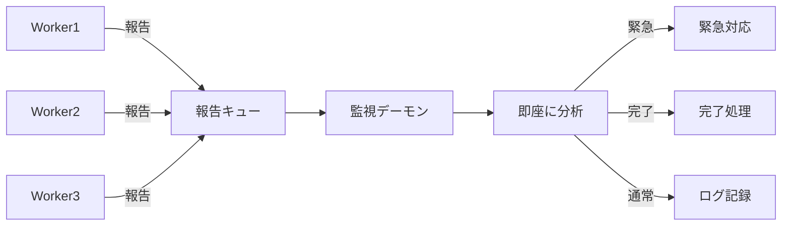

# 📡 リアルタイム報告監視システム ガイド

## 概要

リアルタイム報告監視システムは、Workerからの報告を**待たずに即座に処理**する非同期システムです。

## 🚀 新機能

### 1. リアルタイム監視モード
```bash
# 監視を開始
./agent-send.sh --monitor

# 監視を停止
./agent-send.sh --stop-monitor
```

### 2. 非同期報告受信
```bash
# Worker報告を非同期で受信
./agent-send.sh --async worker1 "ビルドスクリプト修正完了"
./agent-send.sh --async worker2 "BullMQ互換レイヤー実装中"
./agent-send.sh --async worker3 "FFmpeg処理をRailwayに委譲完了"
```

## 📊 動作フロー



## 🎯 利点

1. **待ち時間ゼロ**: 全Workerの報告を待たずに処理開始
2. **並行処理**: 複数の報告を同時に処理可能
3. **優先度対応**: 緊急報告を優先的に処理
4. **効率的**: Boss1が他の作業をしながら報告を受信

## 💡 使用例

### シナリオ1: 緊急エラー対応
```bash
# Worker1がエラーを報告
./agent-send.sh --async worker1 "エラー: Canvas依存関係が解決できません"

# Boss1は即座に対応（他の報告を待たない）
# → 自動的にエラー対応指示を送信
```

### シナリオ2: 段階的完了報告
```bash
# 各Workerが独立して報告
./agent-send.sh --async worker1 "vercel-build.sh作成完了"
./agent-send.sh --async worker2 "BullMQモック実装50%完了"
./agent-send.sh --async worker3 "FFmpeg互換レイヤー設計中"

# Boss1は各報告を受信した瞬間に処理
# → 完了したものから次の指示を送信
```

## 🔧 内部実装

### 報告キュー
- ファイル: `/tmp/worker_reports_queue`
- 形式: `report_id|timestamp|agent|message`
- 処理済み記録: `/tmp/processed_reports.log`

### 監視デーモン
- バックグラウンドプロセスとして動作
- 1秒ごとにキューをチェック
- 新しい報告を即座に処理

### 自動分類
- **緊急キーワード**: エラー、失敗、緊急、critical
- **完了キーワード**: 完了、完成、done、completed
- **通常**: その他の報告

## 📝 注意事項

1. 監視プロセスは手動で停止するまで動作継続
2. システム再起動時は再度 `--monitor` で起動必要
3. 大量の報告がある場合でも順次処理される

## 🚨 トラブルシューティング

### 監視が動作しない
```bash
# プロセスを確認
ps aux | grep report_monitor

# 強制停止して再起動
kill -9 $(cat /tmp/report_monitor.pid)
./agent-send.sh --monitor
```

### キューが詰まった
```bash
# キューをクリア
> /tmp/worker_reports_queue
> /tmp/processed_reports.log
```

---

このシステムにより、Boss1は**より効率的に**Workerを管理できます。