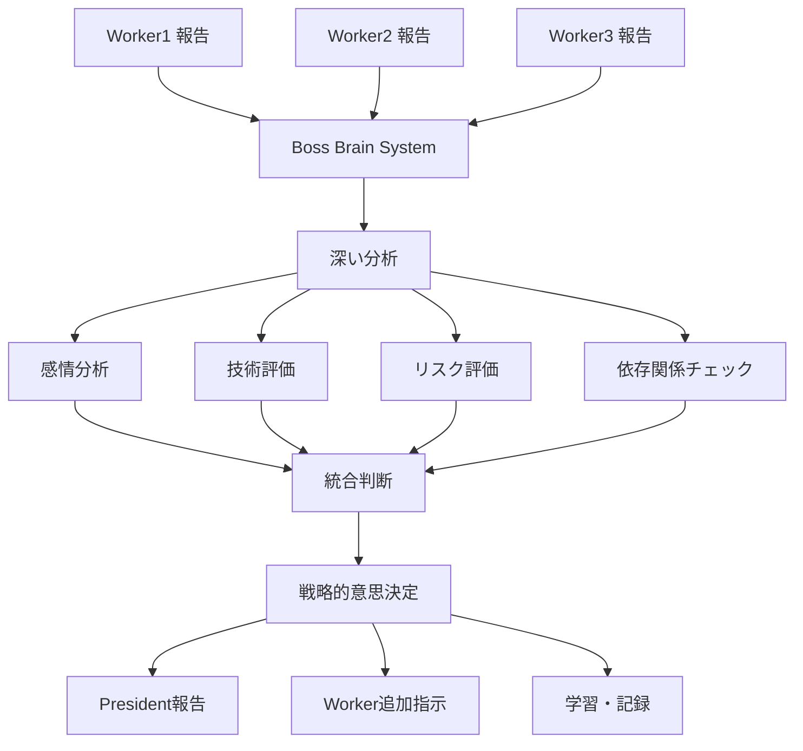

# 🧠 Boss Brain System 動作デモンストレーション

## システム概要

Boss Brain Systemは、Workerからの報告を**深く分析**し、**戦略的判断**を行う自律システムです。

## 動作フロー



## Phase 3 分析実例

### 1. Worker報告の受信と分析

```bash
# Worker1からの報告
./agent-send.sh --auto worker1 "OpenAI Vision API統合が100%完了しました。動画分析精度98%達成。"

# Boss Brain System の分析プロセス
🧠 深い思考プロセス開始...
🔍 深い分析開始: worker1 からの報告
   📊 分析結果: 感情=positive, 技術スコア=0.95, リスク=low
✅ 作業完了パターンを検知
   🎯 高品質な完了と判定
```

### 2. 統合分析

全Workerの報告を統合して分析：

```json
{
    "overall_completion": 0.91,
    "has_blockers": false,
    "critical_issues": "",
    "recommendation": "ready_for_president_report"
}
```

### 3. 戦略的意思決定

```
🎯 戦略的意思決定プロセス
✅ 完了判定: President報告準備
```

## 学習機能

Boss Brain Systemは過去の決定から学習します：

1. **成功パターンの認識**
   - 高品質完了報告のパターン
   - 効果的な問題解決方法
   - 最適な指示タイミング

2. **品質基準の動的調整**
   - 成功率に基づく閾値調整
   - チーム特性の理解
   - 継続的改善

## 実際の使用例

### エラー検出と対応

```bash
# Worker2からエラー報告
./agent-send.sh --auto worker2 "重大エラー: データベース接続が失われました。"

# Boss Brain Systemの対応
❌ エラー報告を検知 - 深刻度: high
🚨 高リスクエラー - 緊急対応モード
📡 リスク評価を全エージェントにブロードキャスト
```

### 隠れた意図の検出

```bash
# Worker3から不安を含む報告
./agent-send.sh --auto worker3 "テストはたぶん大丈夫だと思います..."

# Boss Brain Systemの対応
🔮 メッセージの深層分析
💭 不確実性を検出 - サポート提供
📤 送信: "具体的な懸念点があれば共有してください。一緒に解決策を見つけましょう。"
```

## システムメリット

1. **深い理解**: 表面的な報告内容だけでなく、感情や意図を分析
2. **戦略的判断**: 全体最適を考慮した意思決定
3. **継続的学習**: 過去の経験から改善
4. **プロアクティブ**: 問題の兆候を早期検出
5. **自律性**: Presidentの指示なしでも適切に対応

## 今後の発展

- より高度なNLP分析
- 予測モデルの実装
- チーム間コラボレーション最適化
- リアルタイムダッシュボード