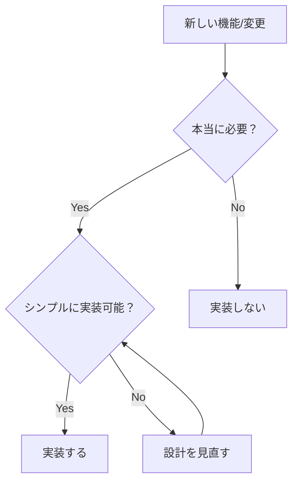

# 🎯 シンプリシティ・チェックリスト

## 組織の品質革命ガイドライン

### 📋 1. 「これは本当に必要か？」判断基準

#### A. 即座に答えるべき3つの質問
1. **これを削除したら何が壊れるか？**
   - 答えられない → 不要の可能性大
   - 明確に答えられる → 必要

2. **1行で説明できるか？**
   - できない → 複雑すぎる
   - できる → 適切な粒度

3. **新人が5分で理解できるか？**
   - できない → 再設計が必要
   - できる → 良い設計

#### B. レッドフラグ（危険信号）
- [ ] 「念のため」という言葉を使っている
- [ ] 「将来のために」と言っている
- [ ] 「完璧を目指して」と考えている
- [ ] 「他の人がそうしているから」が理由
- [ ] ドキュメントが実装より長い

### 🚨 2. 複雑さの兆候リスト

#### コードの複雑さ
```
❌ 複雑な兆候:
- 3重以上のネスト
- 5個以上のパラメータ
- 100行を超える関数
- 抽象化の抽象化
- "Manager" や "Helper" という名前

✅ シンプルな代替:
- フラットな構造
- 3個以下のパラメータ
- 30行以下の関数
- 直接的な実装
- 具体的な名前
```

#### テストの複雑さ
```
❌ 複雑な兆候:
- モックの森
- 条件分岐だらけのテスト
- テストのためのテストヘルパー
- 実装より長いテスト
- 脆いセレクター

✅ シンプルな代替:
- 実際の動作を確認
- 単一の明確な期待値
- 直接的なアサーション
- 最小限のセットアップ
- 安定した要素を選択
```

### 💡 3. シンプルな代替案の探し方

#### ステップ1: 現状を疑う
```bash
# 自問自答テンプレート
1. なぜこれが必要だと思うのか？
2. もっと簡単な方法はないか？
3. これを削除したらどうなるか？
4. 5歳児に説明できるか？
```

#### ステップ2: 最小実装から始める
```javascript
// ❌ 複雑な開始
class UserAuthenticationServiceManagerFactory {
  // 200行のコード...
}

// ✅ シンプルな開始
function login(email, password) {
  // 10行のコード
}
```

#### ステップ3: 段階的に追加
- 本当に必要になってから追加
- YAGNIの原則（You Aren't Gonna Need It）
- 使われていない機能は即削除

## 📚 成功パターンの文書化

### 認証テスト成功の教訓

#### 1. 問題の本質
```
期待: テストが "Sign In" というタイトルを期待
現実: アプリは "SNS Video Generator" を表示
```

#### 2. シンプルな解決
```diff
- 実装を複雑に変更してテストに合わせる
+ テストを現実に合わせる（1行の変更）
```

#### 3. 得られた洞察
- **現実優先**: 動いているものが正義
- **最小変更**: 1行で解決できることに100行使わない
- **柔軟性**: 厳密すぎるテストは脆い

### テストを現実に合わせる哲学

#### 原則1: 実装は正しいと仮定する
```javascript
// ❌ テストのために実装を変える
// "このテストを通すために、アプリにSign Inページを追加しよう"

// ✅ テストを実装に合わせる
// "アプリは正しく動いている。テストの期待値を修正しよう"
```

#### 原則2: 本質的な動作のみテスト
```javascript
// ❌ 実装の詳細をテスト
expect(button.className).toBe('btn btn-primary btn-lg')

// ✅ ユーザー視点でテスト
expect(button).toBeVisible()
```

#### 原則3: 変化に強いテストを書く
```javascript
// ❌ 脆いテスト
expect(page.locator('.header > div:nth-child(3) > button')).toBeVisible()

// ✅ 堅牢なテスト
expect(page.locator('button[type="submit"]')).toBeVisible()
```

## 🌟 新メンバー向けガイド

### 「皇帝は裸だ」マインドセット

#### 恐れずに質問する
- 「なぜこれが必要なんですか？」
- 「もっと簡単な方法はありませんか？」
- 「これを削除したらどうなりますか？」

#### 複雑さを指摘する勇気
```
👶 新人: "このコード、理解するのに1時間かかりました"
🧠 正解: それは複雑すぎる証拠！

👶 新人: "このテスト、何をテストしているか分かりません"
🧠 正解: テストが悪い。あなたは正しい！
```

### シンプリシティ原則の実践方法

#### 日常の実践
1. **朝の儀式**: 「今日は何を削除できるか？」
2. **PRレビュー**: 「これをもっと簡単にできないか？」
3. **リファクタリング**: 複雑さを見つけたら即座に簡素化

#### コードレビューのチェックリスト
- [ ] 5分で理解できるか？
- [ ] 削除できる部分はないか？
- [ ] より簡単な方法はないか？
- [ ] 新人に説明できるか？

#### 意思決定フレームワーク


### 組織文化として定着させる

#### 週次シンプリシティ・レビュー
- 最も複雑な部分を特定
- チームで簡素化方法を議論
- 実際に簡素化を実行

#### 成功を祝う
- コード削除の表彰
- シンプル化の事例共有
- 「複雑さを指摘した勇気」を評価

## 🎯 実践例: 認証テスト修正

### Before (複雑な思考)
```
"テストが失敗している...
→ 実装が間違っているかも
→ 認証システムを再設計しよう
→ 新しいライブラリを導入しよう
→ チーム全体で2週間かけて..."
```

### After (シンプルな思考)
```
"テストが失敗している...
→ 期待値を確認
→ 実装を確認
→ 期待値を現実に合わせる
→ 1行修正、5分で完了！"
```

## 📝 最後に

> "Perfection is achieved, not when there is nothing more to add, but when there is nothing left to take away."
> — Antoine de Saint-Exupéry

完璧とは、付け加えるものがなくなったときではなく、削ぎ落とすものがなくなったときに達成される。

**今日から実践:**
1. 複雑なものを見つけたら声を上げる
2. シンプルな代替案を提案する
3. 勇気を持って「なぜ？」と問う

シンプリシティは選択であり、文化であり、競争優位性です。