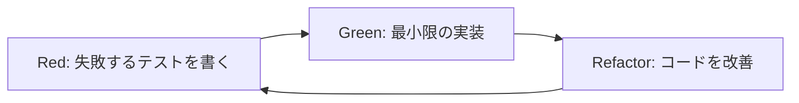

# 🎬 TDD実証: 動画サムネイル生成機能

## 概要

シンプルで明確な機能を使って、TDDの威力を実証します。

### なぜサムネイル生成機能？

1. **明確な入出力**
   - 入力: 動画ファイルパス + タイムスタンプ
   - 出力: 画像ファイル（PNG/JPEG）

2. **ビジネス価値**
   - SNS投稿時の見栄え向上
   - ユーザーエンゲージメント向上
   - 動画プレビュー機能の基盤

3. **テストしやすさ**
   - 純粋関数として実装可能
   - 外部依存はFFmpegのみ
   - 結果が視覚的に確認可能

## 🔄 TDDサイクル設計

### Red → Green → Refactor



### サイクル1: 基本的なサムネイル生成

#### Red (失敗するテスト)
```typescript
// tests/thumbnail-generator.test.ts
import { generateThumbnail } from '@/lib/video/thumbnail-generator';

describe('動画サムネイル生成', () => {
  test('動画の指定時間からサムネイルを生成する', async () => {
    const videoPath = '/test/sample.mp4';
    const timestamp = 10; // 10秒地点
    
    const result = await generateThumbnail(videoPath, timestamp);
    
    expect(result.success).toBe(true);
    expect(result.thumbnailPath).toMatch(/\.(png|jpg|jpeg)$/);
  });
});
```

#### Green (最小限の実装)
```typescript
// lib/video/thumbnail-generator.ts
export async function generateThumbnail(
  videoPath: string, 
  timestamp: number
): Promise<{ success: boolean; thumbnailPath?: string }> {
  // 最小限の実装
  return {
    success: true,
    thumbnailPath: '/tmp/thumbnail.png'
  };
}
```

#### Refactor (改善)
```typescript
// 実際のFFmpeg実装を追加
import { exec } from 'child_process';
import { promisify } from 'util';

const execAsync = promisify(exec);

export async function generateThumbnail(
  videoPath: string,
  timestamp: number
): Promise<{ success: boolean; thumbnailPath?: string; error?: string }> {
  const outputPath = `/tmp/thumbnail_${Date.now()}.png`;
  
  try {
    await execAsync(
      `ffmpeg -i "${videoPath}" -ss ${timestamp} -vframes 1 "${outputPath}"`
    );
    
    return {
      success: true,
      thumbnailPath: outputPath
    };
  } catch (error) {
    return {
      success: false,
      error: error.message
    };
  }
}
```

### サイクル2: エラーハンドリング

#### Red
```typescript
test('存在しない動画ファイルでエラーを返す', async () => {
  const result = await generateThumbnail('/not/exist.mp4', 10);
  
  expect(result.success).toBe(false);
  expect(result.error).toContain('not found');
});

test('負のタイムスタンプでエラーを返す', async () => {
  const result = await generateThumbnail('/test/sample.mp4', -5);
  
  expect(result.success).toBe(false);
  expect(result.error).toContain('Invalid timestamp');
});
```

#### Green
```typescript
export async function generateThumbnail(
  videoPath: string,
  timestamp: number
): Promise<ThumbnailResult> {
  // バリデーション追加
  if (timestamp < 0) {
    return {
      success: false,
      error: 'Invalid timestamp: must be non-negative'
    };
  }
  
  if (!fs.existsSync(videoPath)) {
    return {
      success: false,
      error: 'Video file not found'
    };
  }
  
  // ... 既存の実装
}
```

### サイクル3: オプション追加

#### Red
```typescript
test('カスタムサイズでサムネイルを生成する', async () => {
  const result = await generateThumbnail('/test/sample.mp4', 10, {
    width: 320,
    height: 180
  });
  
  expect(result.success).toBe(true);
  // 画像サイズの検証
});

test('複数のサムネイルを一度に生成する', async () => {
  const result = await generateMultipleThumbnails('/test/sample.mp4', [
    { timestamp: 0 },    // 開始
    { timestamp: 30 },   // 30秒
    { timestamp: 60 }    // 1分
  ]);
  
  expect(result.thumbnails).toHaveLength(3);
});
```

## 📝 実装計画

### ファイル構造
```
sns-video-generator/
├── src/
│   └── lib/
│       └── video/
│           ├── thumbnail-generator.ts      # メイン実装
│           ├── thumbnail-generator.test.ts # テスト
│           └── types.ts                    # 型定義
├── tests/
│   └── fixtures/
│       └── sample-video.mp4               # テスト用動画
```

### 型定義
```typescript
// types.ts
export interface ThumbnailOptions {
  width?: number;
  height?: number;
  format?: 'png' | 'jpeg';
  quality?: number; // 1-100 (JPEGのみ)
}

export interface ThumbnailResult {
  success: boolean;
  thumbnailPath?: string;
  error?: string;
  metadata?: {
    width: number;
    height: number;
    format: string;
    fileSize: number;
  };
}

export interface BatchThumbnailRequest {
  timestamp: number;
  options?: ThumbnailOptions;
}
```

## 🤝 ペアプログラミング計画

### Worker1との協働

#### 役割分担
- **Worker2 (Navigator)**: TDD設計、テスト作成
- **Worker1 (Driver)**: 実装、リファクタリング

#### セッション構成（1時間）
1. **準備** (10分)
   - 機能要件の確認
   - TDDサイクルの説明

2. **サイクル1** (15分)
   - Red: Worker2がテストを書く
   - Green: Worker1が実装
   - Refactor: 一緒に改善

3. **サイクル2** (15分)
   - 役割交代して実施

4. **サイクル3** (15分)
   - 複雑な要件に挑戦

5. **振り返り** (5分)
   - 学んだこと
   - 改善点

### 知識共有方法

#### リアルタイムドキュメント
```markdown
# TDDセッション記録

## セッション1: 基本実装
- 時刻: 
- 参加者: Worker1, Worker2
- 学び:
  - テストファーストの利点
  - 小さなステップの重要性

## コードスニペット
[実際のコードを記録]

## 次回への申し送り
```

#### ペアプロのルール
1. **15分交代制**: ドライバーとナビゲーターを交代
2. **考えを声に出す**: 思考プロセスを共有
3. **批判より提案**: 「〜はどうですか？」
4. **休憩を取る**: 45分作業、15分休憩

## 🎯 期待される成果

### 技術的成果
- [ ] 100%テストカバレッジの機能
- [ ] シンプルで拡張可能な設計
- [ ] 再利用可能なユーティリティ

### チーム成果
- [ ] TDDの実践知識
- [ ] ペアプロのベストプラクティス
- [ ] 知識共有の文化

### ビジネス成果
- [ ] 動画プレビュー機能の基盤
- [ ] SNS投稿時の品質向上
- [ ] ユーザー体験の改善

## 🚀 次のステップ

1. **テスト環境準備**
   - FFmpegのモック作成
   - テスト用動画ファイル準備

2. **CI/CD統合**
   - GitHub Actionsでの自動テスト
   - カバレッジレポート生成

3. **機能拡張**
   - 動画全体のサムネイルグリッド生成
   - AI による最適フレーム選択
   - サムネイルへのテキスト追加